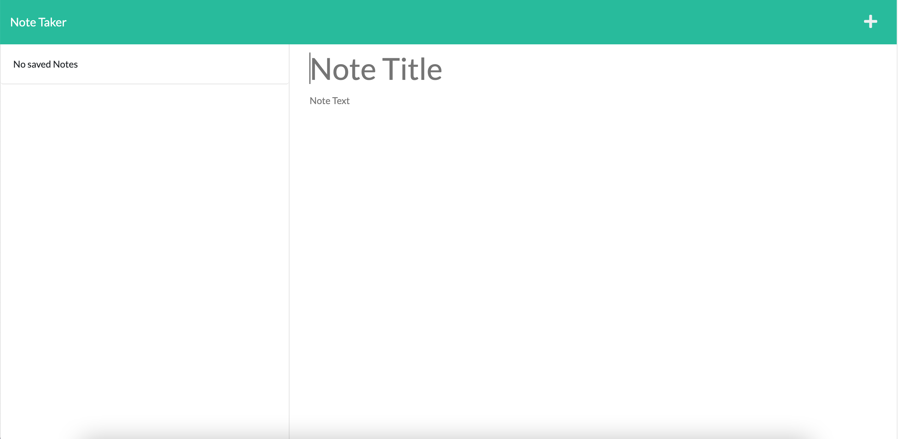

# C11_Note_Taker

  ## Table-of-Contents
  * [Description](#description)
  * [Installation](#installation)
  * [Usage](#usage)
  * [Contributing](#contributing)
  * [Tests](#tests)
  * [Questions](#questions)
  * [Sample](#sample)
  * [Links](#links)
 
  ## Description
  This note taking app uses Express JS to write and save notes into a JSON file. This application is hosted by Heroku.

  ## Installation
  Navigate to the link below to access the app

  ## Usage
  Write and save notes

  ## Contributing
  Currently, I am not accepting contributors for this project

  ## Tests
  N/A

  ## Questions
  For any questions, please reach out to me at the following:
  - GitHub: https://github.com/ahuang23
  - Email: a.huang232@gmail.com

  ## Sample
  

  ## Links
  [GitHub](https://github.com/ahuang23/C11_Note_Taker)
  [Deployed App](https://notetakerappp.herokuapp.com/)